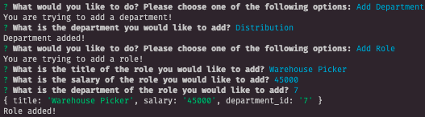
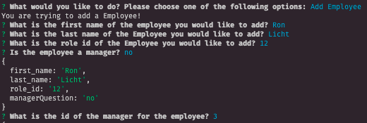
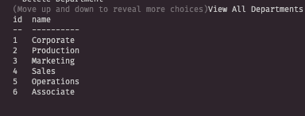
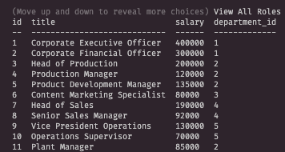
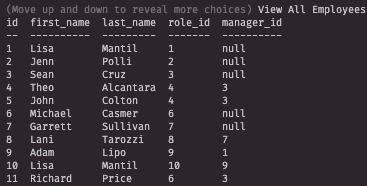
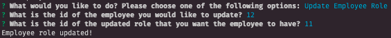

<h1> Employee CMS </h1>
<h2> Description </h2>

 This is an employee content management system utilizing <code>Node.js</code>, <code>Inquirer</code>, and <code>MySQL</code> that can be run on a command line to allow a user to manage their company's employees. The user has the ability to view and manage the departments, roles, and employees of their company. 

<h2> Table of Contents </h2>

Table of Contents

<ol>
<li><a href='#installation'>Installation</a></li>
<li><a href='#usage'>Usage</a></li>
<li><a href='#contribution'>Contribution</a></li>
<li><a href='#tests'>Tests</a></li>
<li><a href='#questions'>Questions</a></li>

## <h3 id='installation'>Installation</h3>

 This system requires the a local MySQL server. Clone this repo to your local device and  run the command <code>npm i</code> to install Node packages. 

## <h3 id='usage'>Usage</h3>

 The user can run <code>node server.js</code> in their command line. 

<iframe width="560" height="315" src="https://www.youtube.com/embed/NkBa6c8O190?start=12" title="YouTube video player" frameborder="0" allow="accelerometer; autoplay; clipboard-write; encrypted-media; gyroscope; picture-in-picture" allowfullscreen></iframe>

Add Department + Add Role:

Add Employee:

View Departments:

View Roles:

View Employees:

Update Employee Roles:

## <h3 id='contribution'>Contributing</h3>

 Functionalities are still being added to this application. If you would like to contribute or provide any feedback, please contact me. You can find contact information below in the <a href='#questions'>Questions</a> section. 

## <h3 id='testing'>Tests</h3>

 There are no testing guidelines for this project. 

## <h3 id='questions'>Questions</h3>

Have questions? Please feel free to reach out to me on github at <a href='https://github.com/skcruzer'target='_blank'>skcruzer</a> or by email at <a href='mailto:seankennethcruz@gmail.com'target='_blank'>seankennethcruz@gmail.com</a>.

- - -
© 2022 Skcruzer, Inc. All Rights Reserved.